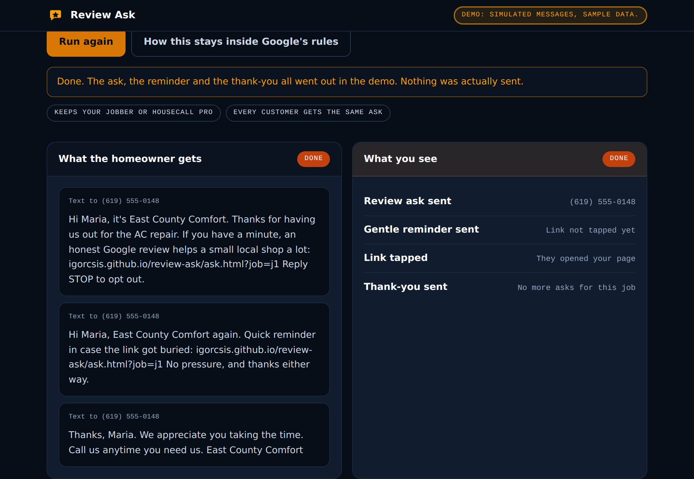
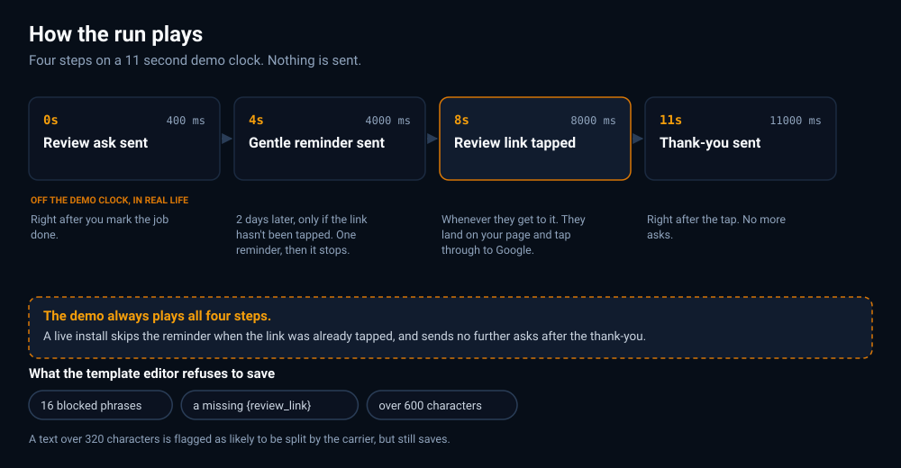
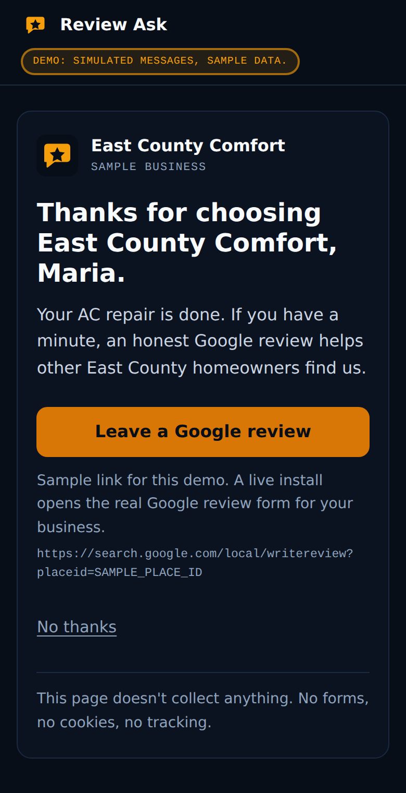

<p align="center">
  
</p>

<p align="center">
  <a href="https://github.com/IgorCSIS/review-ask/actions/workflows/deploy.yml"></a>
  
  
</p>

# Review Ask

The job is finished, the homeowner is happy, and nobody asks. The review that
would have brought the next three customers never gets written, because asking
is the step that falls off the end of the day.

This is a click-through demo of the whole ask: one short message by text or
email, a gentle reminder only if the link was never tapped, and a thank-you
once it is. It is built for HVAC and plumbing owners in East County San Diego,
and it sits next to Jobber or Housecall Pro rather than replacing either.

**Live:** https://igorcsis.github.io/review-ask/

Nothing on either page sends anything. Every message is simulated, the three
jobs are invented, and the header chip says so at every scroll position.



## How the run plays



The demo compresses about two days into eleven seconds. The run is paced
against the wall clock rather than by chaining delays, so a slow frame or a
backgrounded tab cannot let a step drift away from the second printed next to
it. That pacing holds under `prefers-reduced-motion: reduce` too: the
preference drops the pulse and slows the elapsed ticker from ten updates a
second to one, but the four steps still arrive in order and still take eleven
seconds, because the sequence is the content here and not decoration.

One honest mismatch, visible on the diagram: the first step is labelled `0s`
on the page but fires at `400ms` in the code, so the busy state gets painted
before it is replaced. The other three land exactly on their printed second.

## What it is, and what it is not

It is hand-written HTML, CSS and JavaScript. No framework, no build step, no
dependencies, no network calls. There is no `fetch`, no `XMLHttpRequest`, no
`sendBeacon`, no form that posts, and no web font.

It stores one thing: your template edits, under the key `reviewAsk.v1`. Which
jobs have been asked lives in memory, so a reload is a fresh demo.

It is not a CRM and not a reputation dashboard. No inbox, no review monitoring,
no scores. A live install is a done-for-you setup on top of the messaging tool
a shop already pays for.

## How this stays inside Google's rules

Google's policies forbid two things that review tools reach for: offering
something in exchange for a review, and asking only the customers you expect to
say something nice. The second one is called review gating.

**Every customer gets the same ask.** The homeowner page has one review link
and no rating widget, so nothing on it decides which link you see. There is a
`No thanks` button, which is a way out rather than a fork: it changes nothing
about the link, and it is the only other control on the page.

**Nothing is offered for a review.** The template editor refuses to save
wording containing any of 16 blocked phrases, and names the one it found. They
cover rewards (`"gift card"`, `"discount"`, `"coupon"`, `"% off"`, `"free "`,
`"raffle"`, `"giveaway"`, `"reward"`, `"in exchange"`), rating-specific asks
(`"5-star"`, `"5 star"`, `"five star"`), and gating (`"only if you"`,
`"if you were happy"`, `"if you loved"`, `"if you had a great"`).

`"free "` carries a trailing space on purpose, so `"freezing"` and `"freedom"`
do not trip it. That also means `"free!"` and `"free."` get through, which is
the honest cost of not having false positives on ordinary words.

**The wording asks for an honest review, never a 5-star one.** None of the nine
shipped default fields (three for text, six for email) trips any of the 16
phrases.

The phrase list is checked in two places, not one: when you save in the editor,
and again when saved wording is read back out of `localStorage`. The second
check matters because anything on the origin could have written that key. A
stored value that fails drops back to the shipped default rather than being
rendered. Saving an ask or a reminder without `{review_link}` is blocked too,
and so is saving an empty field.

## The homeowner page



One job, one link, and a line saying the page collects nothing. The `?job=`
parameter is matched against the three known ids and never echoed; an unknown
or missing value falls back to the generic wording.

The Google link is a placeholder,
`https://search.google.com/local/writereview?placeid=SAMPLE_PLACE_ID`, and it
is labelled as a sample on the page. It lives in `data.js` and the button's
`href` is set from that constant, so there is one source of truth for the one
URL that must never drift. The markup carries the same literal as a fallback
for scripting-off.

## Stack decision

| Piece | Choice | Why |
| --- | --- | --- |
| Pages | Two hand-written HTML files | The demo is two screens. A framework would be more build than product. |
| Styles | Plain CSS with custom properties | 19 tokens on `:root`, all of them read. Shared visual lane with the other demos in the set. |
| Scripts | `data.js` plus one file per page, each in an IIFE | No ES modules, so both pages also open straight from `file://`. |
| Timing | Absolute, against `startedAt` | Chained delays drift. Every step carries both its demo clock and its real-life meaning. |
| Storage | `localStorage` for template edits only | Everything else is in memory, so a reload is a clean demo. |
| Images | SVG only | No raster anywhere except the README screenshots. |
| Hosting | GitHub Pages, repository root uploaded as-is | No build step means what is in the repo is what is served. |
| Messaging | None | Nothing is sent. A live install uses the shop's own messaging account. |

Two globals are exported, both deliberate:

- `window.ReviewAskData` (`data.js`, 12 keys) is the shared module both pages
  read. It is what keeps the console's "See what Maria sees" link pointing at
  the same job Maria's page greets.
- `window.reviewAskDemo` (`app.js`, 5 keys) is the test hook, on the console
  page only.

Nothing else reaches the global scope.

## Running locally

Any static server works, and so does opening the files directly:

```
python3 -m http.server 8000
# then http://localhost:8000/
```

Both pages also open straight from the file system. That is checked rather than
assumed: with Chromium on a `file://` origin, `data.js` and the page script
both execute under `script-src 'self'`, the job cards render, the greeting
personalises, and no CSP refusal appears in the console.

The test hook on the console page:

```js
window.reviewAskDemo.select("email")  // switch channel, validated
window.reviewAskDemo.pick("j2")       // switch job, validated against JOBS
window.reviewAskDemo.run()            // run the whole sequence
window.reviewAskDemo.reset()          // back to a fresh demo
window.reviewAskDemo.clock            // the ms marks the steps land on
```

`clock` is the live object by reference, so assigning to it retimes the demo.
That is useful for driving the sequence quickly in a test and worth knowing
before you trust it as a read-only value.

## Enabling GitHub Pages

Settings, Pages, Source: **GitHub Actions**. `deploy.yml` runs on every push to
`main`, uploads the repository root unchanged, and deploys it.

## Layout

```
index.html        the owner console: pick a job, pick a channel, run the ask
ask.html          the homeowner page: one job, one link
app.js            the console: run loop, template editor, job list
ask.js            the homeowner page: ?job= matching and the decline path
data.js           jobs, company, default wording, the blocked phrases, and
                  every shared constant (storage key, caps, placeholders,
                  template field lists, the sample review URL)
styles.css        shared styles, on the contractor lane tokens
assets/logo.svg       32x32 mark, a speech bubble with one star
assets/favicon.svg    the same mark
assets/banner.svg     1200x300 README banner
assets/how-it-runs.svg  the run diagram above, drawn from the real constants
assets/shots/         README screenshots, captured from the built page
.github/workflows/deploy.yml             build and publish to Pages
.github/workflows/no-ai-attribution.yml  fails the build on any AI credit line
CONVENTIONS.md    repository rules, including no AI attribution
LICENSE           MIT
```

## Security notes

Both pages carry a Content-Security-Policy meta tag as the first element in
`<head>`, and the two policy strings are byte-identical. `default-src 'none'`,
so anything not named is refused. Only same-origin scripts and styles load,
`connect-src` is `'none'`, and `form-action` is `'none'`.

There is no inline script, no inline style attribute and no inline event
handler anywhere, because the policy forbids all three with no `'unsafe-inline'`
in either `script-src` or `style-src`.

Everything that reaches either page is built with `createElement` and
`textContent`. Nothing calls `innerHTML`, `outerHTML`, `insertAdjacentHTML`,
`document.write`, `eval`, `new Function`, or `setTimeout` with a string. Those
seven names appear in this repository only in two comments in `app.js`, which
name `innerHTML`, and in this paragraph.

Saved templates are treated as untrusted: parsed inside a `try`/`catch`,
accepted only as strings, capped at 600 characters each, checked against the
blocked phrases, and dropped back to the shipped default on any mismatch. The
fallback is per field, so a half-corrupt stored value yields a mix of saved and
shipped wording rather than an all-or-nothing reset.

One limit worth naming rather than papering over: `frame-ancestors` can only be
set from a response header, and GitHub Pages does not let you set headers, so
this repository cannot stop the pages being framed. There is nothing on them to
clickjack, but the gap is real.

## The data in the demo

Three invented jobs for a fictional shop, East County Comfort in El Cajon. The
customer names, the phone numbers and the jobs are made up. The phone numbers
sit inside the 555-0100 to 555-0199 block that exists for fiction, and the
email addresses use `example.com`, which is reserved for exactly this. The
towns (El Cajon, Santee, La Mesa) are real East County cities, because the
point of the demo is that it is local.

| Job | Customer | Work | Town | Finished |
| --- | --- | --- | --- | --- |
| `j1` | Maria Lopez | AC repair | El Cajon | Today |
| `j2` | Daniel Reyes | Furnace tune-up | Santee | Yesterday |
| `j3` | Karen Whitfield | Mini-split install | La Mesa | Friday |

## The rest of the chain

Respond fast, follow up, win the job, ask for the review, check the books:

- [Instant Lead Response](https://github.com/IgorCSIS/instant-lead-response)
- [Lead Follow-up](https://github.com/IgorCSIS/lead-followup)
- [Ridgeview Remodeling](https://github.com/IgorCSIS/ridgeview-remodeling-demo)
- Review Ask, this one
- [Job Cost Odd-One-Out](https://github.com/IgorCSIS/job-cost-odd-one-out)

## License

MIT. See [LICENSE](LICENSE).
